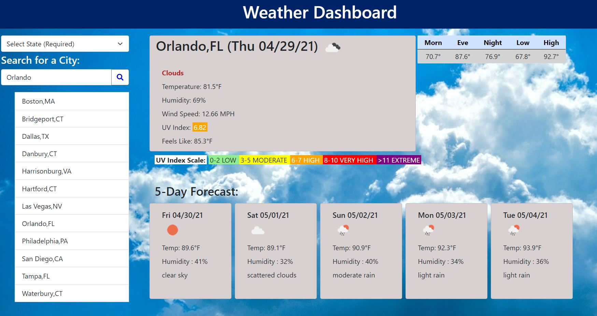

# 🌤️ Weather Dashboard

```
Application for travelers to pull current and 5-day forecast for potential travel destinations.

```

## 📋 Criteria

- The application should allow a user to select a State and City to pull weather data for.
- The current data will display: City, State, Date, Temperature, Humidity, Wind Speed, UV index.
- The results will display an icon representing the current conditions along with a color indicator for the UV Index.
- A 5-day forecast will be shown containing Date, Temperature, Humidity and an icon representing the future weather conditions.
- The application should store the search results in local storage and allow the user to quickly check the weather for cities done in a prior search.
- The data source to be used will be the [Openweathermap](https://openweathermap.org) API.

---

## 1️⃣ Steps used

1. Created the dashboard layout with HTML, Bootstrap, and CSS.
2. Tested 2 API's from Openweathermap, the [Geocoding API](https://openweathermap.org/api/geocoding-api) to pull Lat and Lon coordinates to be used as parameters for the newer [One Call API](https://openweathermap.org/api/one-call-api) which returns a 7-day forecast.
3. Added Bootstrap button, select and card controls to the interface.
4. Added [icons](http://openweathermap.org/img/wn/04d.png) to the weather results from Openweather based on the icon name in the result set.
5. Added a custom js file, included variables and functions to work with moment.js, and Openweather.
6. Created functions for the JSON results to populate the dashboard and to save and retrieve data from local storage.
7. Added a custom css file for styling outside of Bootstrap.
8. Added a UV index scale to show the severity of the weather conditions.
9. Added a table to show the daily temperatures for the current day for High, Low, and Morn, Eve and Night timeframes.

Final results: [Weather Dashboard](https://malmason.github.io/weather-api/)

---

## 📸 Screenshots

**Weather Dashboard**



**Current Day Card** - Detailed weather forecast for the current day, along with a UV Index scale.


## 📱 Contact

Malcolm Mason - [Github](https://github.com/malmason) Email: [Malcolm](mailto:malmason66@gmail.com) 📧

---

&copy; 2021 Malcolm Mason
